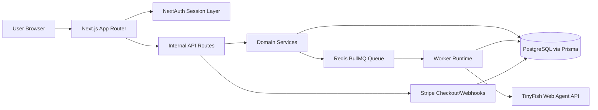

# WebOps AI Architecture

Last updated: 2026-03-03

## System Overview

WebOps AI is a multi-tenant SaaS platform that orchestrates AI web agents for real website workflows.

## Runtime Components

- Web app (`next start`):
  - Serves dashboard UI and API routes.
  - Enforces auth, org scope, billing checks, and request validation.
- Worker (`npm run worker`):
  - Consumes execution jobs from BullMQ.
  - Calls TinyFish API and persists execution/log state.
- PostgreSQL:
  - Source of truth for tenants, agents, workflows, executions, billing data.
- Redis:
  - Queue backend for async execution processing.
- Stripe:
  - Checkout session orchestration and subscription lifecycle events.

## Data Flow: Execution Trigger

1. User triggers workflow execution in dashboard.
2. API validates request, checks role and quota, and creates queued execution row.
3. API enqueues BullMQ job and stores trace metadata.
4. Worker picks job, calls TinyFish, and streams execution logs.
5. Worker updates execution status and output payload.
6. Dashboard polls APIs and renders timeline/log updates.

## Multi-Tenancy Model

- `Organization` is the tenant boundary.
- `Membership` controls user role within each organization.
- All major records (`Agent`, `Workflow`, `Execution`, `ExecutionLog`, `Subscription`, `UsageRecord`) are organization-scoped.
- Repositories/services require `organizationId` for query and write operations.

## Deployment Topology

- Containerized services:
  - `web` (Next.js app)
  - `worker` (BullMQ consumer)
  - `postgres`
  - `redis`
- `docker-compose.yml` supports local and pre-prod parity.
- Production guidance is documented in `docs/DEPLOYMENT.md`.
